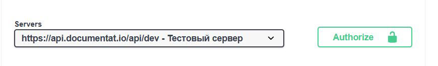

# Введение

Это пример документирование API.

## Быстрый старт

Чтобы начать работать с API, необходимо пройти несколько простых шагов:
* получить API-ключ;
* изучить описание текущей документации с статье [Обзор](overview.md);
* изучить [Справочник API](swagger.md).

## Аутентификация

Для работы с API необходимо получить API-ключ. Его можно получить, обратившись в компанию Documentat.io.

!!! warning Внимание!
    Применить API-ключ для аутентификации и работать с методами `PUT` и `PATCH` можно только в тестовом сервере (см. рисунок ниже)
    
