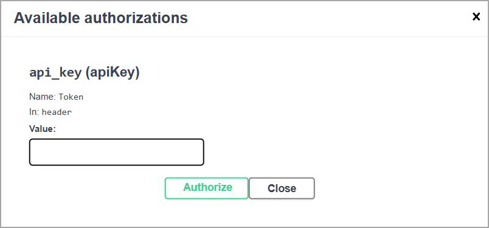

# Введение

Это пример документирование API.

## Быстрый старт

Чтобы начать работать с API, необходимо пройти несколько простых шагов:

* получить API-ключ;
* изучить раздел **Аутентификация** данной статьи;
* изучить описание текущей документации в статье [Обзор](overview.md);
* изучить [Справочник API](swagger.md).

## Аутентификация

Для работы с API необходимо получить API-ключ. Его можно получить, обратившись в компанию [Documentat.io](https://documentat.io/contacts/).

!!! warning "Внимание!"

    Применить API-ключ для аутентификации и работать с методами `PUT` и `PATCH` можно только в тестовом сервере (см. Рисунок 1)
      
    Рисунок 1 — Выбор сервера для работы с API

Для авторизации по API-ключу вы должны:

1. Нажать кнопку **Authorize** (см. Рисунок 1).
1. Ввести его в поле **Value** всплывающего окна (см. Рисунок 2).
1. Нажать кнопку **Authorize** всплывающего окна (см. Рисунок 2).

  
Рисунок 2 — Ввод API-ключа.

## Контакты

По всем проблемам с API можно обратиться в компанию [Documentat.io](https://documentat.io/contacts/).